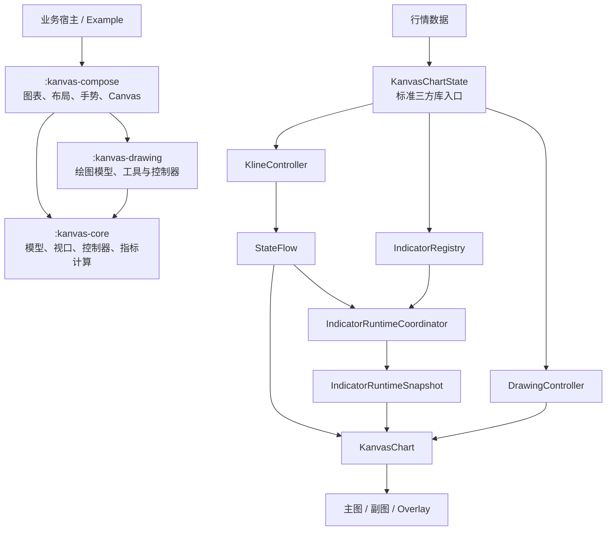
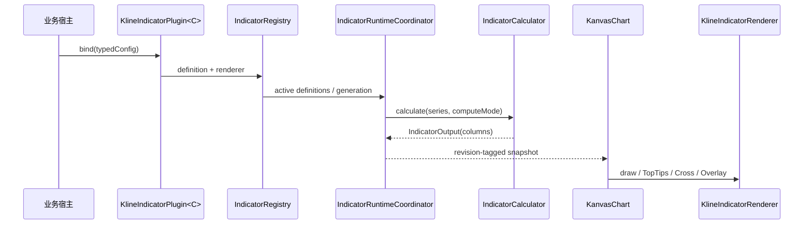

# Kanvas K 线整体架构

本文说明 Kanvas K 线系统的模块职责、运行时数据流、渲染管线、指标机制、交互与扩展方式。

## 架构概览

Kanvas 由领域核心、Compose 图表、绘图能力和示例宿主组成。普通应用通过
`KanvasChartState` Facade 更新行情、指标和画线；Facade 内部将业务数据交给
`KlineController`，指标运行时基于同一份 K 线序列生成带版本标识的计算快照，
`KanvasChart` 再将行情、指标、绘图和交互状态组织成最终 Canvas 画面。

模块依赖保持单向：宿主依赖 Compose，Compose 依赖 Core 并接入 Drawing，Drawing 只依赖
Core。Core 不依赖 Android 或 Compose。

### 两层公开 API

- 标准 API：`rememberKanvasChartState`、接收 `KanvasChartState` 的 `KanvasChart`、
  `KanvasChartConfig`、`KanvasChartCallbacks`。它负责视口回传、分页请求、指标协调器、
  Renderer 生命周期和 DrawingController，适合绝大多数三方库使用者。
- 高级 API：`KlineController`、接收 `KlineUiState` 的 `KanvasChart`、
  `IndicatorRegistry`、`IndicatorRuntimeCoordinator` 和 Renderer SPI。它保留给需要自行拆分
  生命周期、接入非 Compose 状态容器或实现底层插件的项目。

标准 API 只封装和编排现有底层对象，不复制第二套行情、指标或绘制状态。

## 数据模型与约定

- `KlineCandle` 表示单根 K 线，包含时间戳、OHLC、成交量、成交额和确认状态。
- `KlineSeries` 采用“最新数据在前”的顺序；指标输出列与其保持相同索引方向。
- `KlineSpec` 描述交易对、周期和价格精度，`KlineInterval` 描述周期单位与数量。
- 时间戳统一使用毫秒。交易所响应排序、分页边界去重和重叠数据修正由宿主适配层完成。
- UI 与指标运行时通过不可变快照传递状态，避免渲染期间读取可变行情集合。

标准 Facade 对外提供语义化操作，并委托给 `KlineController`：

| 场景 | 操作 | 结果 |
| --- | --- | --- |
| 首次加载或切换交易对 | `setMarket` | 选择市场并替换当前完整序列 |
| 完整刷新 | `setData` | 替换已选择市场的完整序列 |
| 实时行情 | `updateLatest` | 更新当前最新 K 线或插入新周期 K 线 |
| 历史分页 | `completeLoadMore` | 在序列尾部追加更早的数据 |

## Core 领域核心

`kanvas-core` 负责与 UI 框架无关的领域状态和计算：

- `KlineViewport`：可见区偏移、柱宽、间距与缩放状态。
- `KlineController`：交易对会话、K 线序列、LRU 缓存、视口约束和加载更多事件。
- `KlineUiState`：供宿主和图表订阅的不可变状态。
- `IndicatorDefinition`：指标标识、放置位置、输入参数和计算器声明。
- `IndicatorCalculator`：以 K 线序列为输入生成数值列。
- `IndicatorOutput`：指标列式输出及其元数据。
- `IndicatorRegistry`：维护指标的 active、hidden、retained 和 generation 状态。
- `IndicatorRuntimeCoordinator`：调度指标计算，并用 revision、token 和 generation 丢弃过期结果。

Core 中的视口数学和指标计算可直接运行 JVM 单元测试。

## Compose 图表与渲染管线

`kanvas-compose` 提供标准 Facade、`KanvasChart` 及其配置、布局、交互和绘制实现。
一次绘制按以下信息组织：

1. 根据 `KlineUiState` 和物理画布宽度计算可见 K 线索引区间。
2. 根据主图价格、可选主图指标和纵轴策略计算数值范围。
3. 规划主图、副图、时间轴和 Overlay 的矩形区域。
4. 绘制背景、网格、K 线或分时线、指标、成交量和坐标轴。
5. 绘制最新价、倒计时、订单标记、Top Tips、Cross、Tooltip 和 Drawing Overlay。

主要公开配置：

- `KanvasChartConfig`：标准 API 的集中配置入口，组合样式、渲染、窗格、时间轴和画线配置。
- `KanvasChartCallbacks`：布局、分页意图、Cross、双击和不支持指标的集中观察入口。
- `KlineChartStyle`：背景、网格、涨跌色、文字、提示框和指标色板。
- `KlineChartRenderConfig`：视口、手势、纵轴、网格、loading、倒计时和 Overlay 行为。
- `KlinePaneRenderConfig`：主图区及副图列表。
- `KlineSubPaneRenderConfig`：单个副图的标识、首选高度和尺寸约束。
- `KlineChartType`：蜡烛图、OHLC 和分时图等显示方式。

### 纵轴范围

主图价格轴默认由当前可见 K 线的高低价决定。`includeMainIndicatorsInValueRange` 控制主图
指标是否扩展价格轴；关闭后，切换 MA、BOLL、SAR、SuperTrend 等主图指标不会改变 K 线自身
的纵向比例。隐藏的指标输出不参与纵轴范围、Top Tips 或 Cross 提示。

最新 K 线更新可通过 `latestCandleRangeSmoothFactor` 平滑范围变化，降低实时价格波动造成的
画面跳动。

## 布局与交互

`KlinePaneRenderConfig(mode = KlineLayoutMode.Adapt)` 根据主图和副图配置计算需要的高度，并在
父布局约束内完成测量。`onLayoutChange` 会发布 pane 几何信息和 `requiredHeightPx`，供宿主协调
图表外部组件。

图表交互包括：

- 单指水平平移及惯性滚动。
- 双指缩放、纵轴拖动缩放和 pane resize。
- 长按十字光标、Tooltip 与时间/价格定位。
- 双击或点击离屏最新价标签返回最新位置。
- 到达历史边界时通过 Controller 触发加载更多。

底部指标栏属于宿主 UI。示例将主图和副图指标放在同一条横向滚动栏中，并使用系统导航栏
安全区和最小点击尺寸，避免靠近屏幕底部时难以操作。

## 指标体系

指标由“类型化配置、计算定义、运行时快照、Renderer”四部分组成：

- `KlineIndicatorPlugin<C>` 将业务可编辑的类型化配置绑定为 Core 定义和 Compose Renderer。
- `IndicatorRuntimeCoordinator` 支持快速计算与指标切换，并保证旧 revision 的结果不会覆盖新画面。
- `KlineIndicatorRenderer` 决定输出列的线、柱、点、参考线和背景如何显示。
- `KlineIndicatorLineStyle` 管理单条输出的颜色、线宽、线型和显隐。
- 指标参数确认后，宿主重新 bind 配置并通过 Registry 更新定义，无需重建图表控制器。

内置指标包括 MA、EMA、BOLL、SAR、AVL、SuperTrend、VOL、MACD、KDJ、RSI、OBV、WR
和 StochRSI。计算与显示边界如下：

- RSI 与 StochRSI 使用 Wilder 平滑。
- SuperTrend 使用 Wilder ATR，上涨段和下跌段使用互斥输出。
- MACD 柱值采用 `2 × (DIF - DEA)`，Renderer 将该列绘制为柱体。
- KDJ 分别使用 K、D 平滑周期。
- BOLL 输出中轨、上轨和下轨。
- RSI 上下轨由 Renderer 作为参考线绘制。
- OBV 可附加独立计算的 MA 或 EMA 输出。

## Drawing 绘图系统

`kanvas-drawing` 使用时间戳和价格值保存图形，使画线在平移、缩放和数据追加后仍锚定到原始
行情位置。该模块包括：

- 绘图模型与工具描述符。
- 创建、选择、编辑和删除状态机。
- 端点拖动、整体移动和磁吸。
- `DrawingController` 及其可观察快照。
- Compose 工具栏和 Android 放大镜集成。

宿主通过可选的 `drawingController` 将绘图状态传给 `KanvasChart`；不需要绘图时可不接入该
控制器。

## 主题与涨跌色

页面主题和图表主题分别由 Material `ColorScheme` 与 `KlineChartStyle` 管理。宿主可根据深浅
模式生成两套稳定样式，并将统一的上涨/下跌语义色映射到：

- K 线实体和影线。
- 成交量柱与涨跌分时区域。
- 最新价等价格语义元素。
- `KlineOrderMarkerRenderConfig` 中的 Buy/Sell 标记。

红涨绿跌模式下，Buy 使用上涨红色、Sell 使用下跌绿色；绿涨红跌模式下则相反。指标设置
面板使用 Material 语义色，跟随页面深浅主题；用户选择的指标线颜色保持独立，不随涨跌色切换。

## Example 集成示例

`example` 展示宿主如何组装完整页面：

- 创建 `KlineController`、行情 fixture 和时间周期状态。
- 注册内置指标插件并连接 `IndicatorRuntimeCoordinator`。
- 将 `KlineUiState`、`IndicatorRuntimeSnapshot`、Renderer Registry 和 Drawing Controller
  传给 `KanvasChart`。
- 提供主图/副图指标切换、参数编辑、线宽与颜色设置。
- 提供深浅主题和红涨绿跌/绿涨红跌切换。
- 处理系统栏安全区、底部指标栏和指标设置 Bottom Sheet。

Example 只承担宿主组装和交互演示，图表领域状态、指标计算与 Canvas 绘制分别由对应模块处理。

## 扩展入口

| 扩展目标 | 接口或配置 |
| --- | --- |
| 接入行情源 | 在宿主层将响应转换为 `KlineCandle`，调用 `KlineController` |
| 新增指标算法 | 实现 `IndicatorCalculator` |
| 新增可配置指标 | 实现 `KlineIndicatorPlugin<C>` 并提供类型化配置 |
| 自定义指标绘制 | 实现 `KlineIndicatorRenderer` |
| 新增副图 | 增加 `KlineSubPaneRenderConfig` 并绑定指标 placement |
| 修改图表外观 | 提供 `KlineChartStyle` |
| 修改手势和范围策略 | 提供 `KlineChartRenderConfig` |
| 新增绘图工具 | 提供 Drawing 工具描述符及对应行为 |

## 测试边界

- Core 测试覆盖 K 线序列、Controller、视口数学和指标数值。
- Compose 测试覆盖布局、交互数学、插件绑定、Renderer 选择与标记定位。
- Drawing 测试覆盖绘图状态机、命中测试、移动和磁吸。
- Example 构建与设备验收覆盖主题、弹窗、指标切换和页面级集成。
