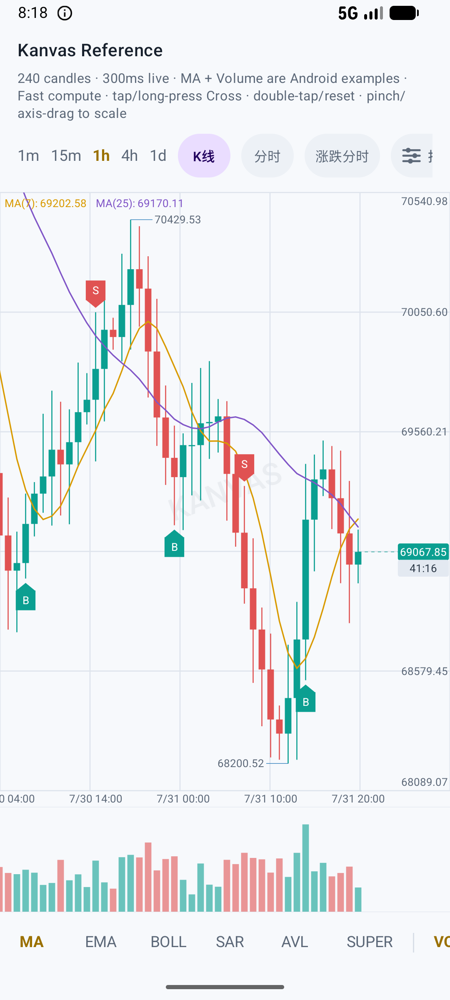
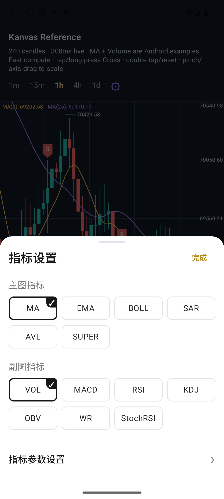
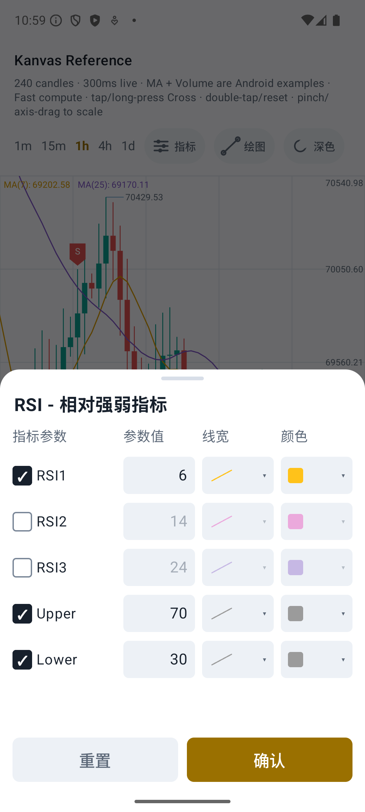
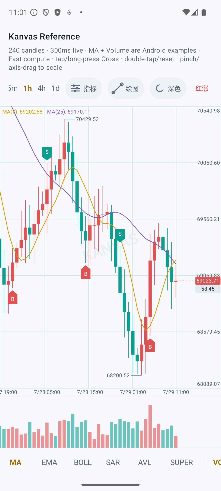
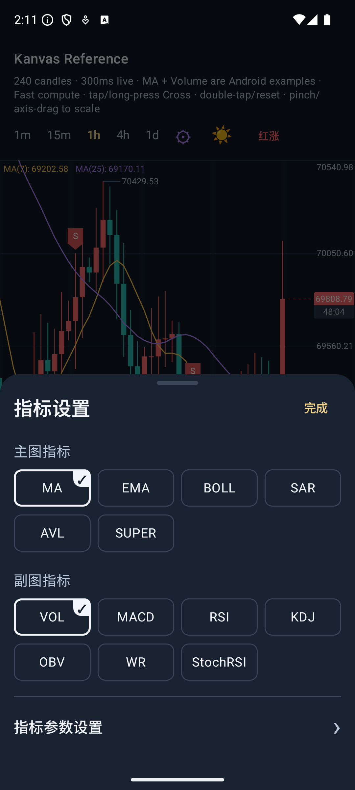

# Kanvas — Native Kline & Candlestick Chart for Jetpack Compose

[](https://github.com/zhumeng1582/Kanvas/actions/workflows/android.yml)
[](LICENSE)
[](https://developer.android.com/about/versions/nougat)

Kanvas is a native Android K-line and candlestick chart library built with
Kotlin and Jetpack Compose. It supports realtime market data, technical
indicators, drawing tools, crosshair tooltips, order markers, multiple panes,
and extensible indicator and renderer plugins without requiring a WebView.

[English](README.md) | [简体中文](README.zh-CN.md)

See [the Chinese architecture overview](ARCHITECTURE.zh-CN.md) for module
boundaries and runtime data flow. For high-frequency feeds, see
[realtime candles, indicator refresh, and range stability](docs/realtime-updates.md).
The example indicator picker and parameter editor are described in
[indicator selection and settings](docs/indicator-settings.md).

Download the installable [Kanvas example APK v0.1.0](docs/downloads/kanvas-example-0.1.0.apk).
It is a release build signed with an Android debug certificate for demonstration
and testing only; production distribution requires your own signing key.

<p align="center">
  
  
  
</p>

<p align="center">
  
  
</p>

## Contents

- [Quick start](#quick-start)
- [Theme and chart style](#theme-and-chart-style)
- [Native watermarks](#native-watermarks)
- [Layout and interaction](#layout-and-interaction)
- [Data and pagination](#data-and-pagination)
- [Order markers](#order-markers)
- [Drawing and persistence](#drawing-and-persistence)
- [Compose-native indicator plugins](#compose-native-indicator-plugins)
- [Sub-panes and custom indicators](#sub-panes-and-custom-indicators)
- [Publishing](#publishing)

The current usable slice includes:

- `kanvas-core`: strict newest-first candle series, explicit data updates, right-edge
  viewport math, LRU controller/cache, loading events, immutable indicator
  snapshots, and indicator active/retained lifecycle state.
- `kanvas-compose`: Compose Canvas/chart APIs plus the Kotlin-native
  indicator plugin SPI, renderers, stateful lifecycle runtime, and Android
  MA/Volume example plugins.
- `kanvas-drawing`: persistent timestamp/value overlays, tool SPI,
  drawing/editing state machine, magnet modes, draggable toolbar and Android
  magnifier integration.
- `example`: an interactive BTC-USDT fixture with Android-example MA and
  Volume plugins, hide/show controls, light/dark themes, red-up/green-up color
  conventions, pan/scale, crosshair, and load-more events.

The built-in examples cover MA, EMA, BOLL, SAR, AVL, SuperTrend, MACD, KDJ,
RSI, OBV, WR, StochRSI, Volume, Candle, and Time. Plugin APIs allow applications
to add their own indicators and renderers.

## Quick start

When consuming the source project, an application normally depends only on
`kanvas-compose`; it exposes the Core and Drawing APIs transitively:

```kotlin
dependencies {
    implementation(project(":kanvas-compose"))
}
```

Run the bundled example:

```bash
./gradlew :example:installDebug
adb shell am start -n com.zhumeng.kanvas.example/.MainActivity
```

Kanvas requires Android minSdk 24, Java 17, and Jetpack Compose.

For a read-only or infrequently replaced chart, pass candles directly. The
default input order is newest-first; an ascending API response can opt into
`OldestFirst`:

```kotlin
KanvasChart(
    candles = candles,
    order = KanvasCandleOrder.OldestFirst,
    spec = KlineSpec("BTC-USDT", KlineInterval.hours(1), precision = 2),
    modifier = Modifier.fillMaxSize(),
)
```

Realtime applications should keep one high-level state. It owns controller,
viewport, loading, drawing, indicator calculation, renderer lifecycle, and
cleanup:

```kotlin
val chartState = rememberKanvasChartState()
val spec = remember {
    KlineSpec("BTC-USDT", KlineInterval.minutes(15), precision = 2)
}

LaunchedEffect(spec) {
    chartState.setMarket(
        spec = spec,
        candles = marketRepository.initialCandles(spec),
    )
}

KanvasChart(
    state = chartState,
    modifier = Modifier.fillMaxSize(),
)
```

Apply realtime and navigation intents directly:

```kotlin
chartState.updateLatest(candle)
chartState.moveToLatest()
chartState.moveTo(timestampMillis)
```

`KanvasChartState` is the standard application API. The original
`KanvasChart(state = KlineUiState, ...)`, `KlineController`, registry, and
renderer arguments remain available as the advanced API for integrations that
need to own every runtime boundary explicitly.

## Theme and chart style

`KlineChartStyle` owns colors, while `KlineChartRenderConfig` owns dimensions,
gestures, grid, Candle, loading, and overlay behavior:

```kotlin
val style = KlineChartStyle(
    background = Color(0xFF0B1220),
    gridLine = Color(0xFF1F2A3A),
    bullish = Color(0xFF19C3A3),
    bearish = Color(0xFFFF5C69),
    ticksTextColor = Color(0xFF9EADBF),
    textColor = Color(0xFFE6EDF5),
    indicatorLines = listOf(Color(0xFFFFC857), Color(0xFFB388FF), Color(0xFF4DD0E1)),
)
val renderConfig = KlineChartRenderConfig(
    gesture = KlineGestureConfig(panSensitivity = 1f, autoLoadMore = true),
)

KanvasChart(
    state = chartState,
    config = KanvasChartConfig(
        style = style,
        render = renderConfig,
        chartType = KlineChartType.Bar(KlineBarStyle.UpHollow),
    ),
)
```

Bar styles include solid, hollow, up/down hollow, and OHLC. Line charts support
normal area fill and a bullish/bearish `UpDown` variant.

The example initially follows the system light/dark setting and exposes a manual
theme toggle. Its adjacent color-convention control switches between red-up /
green-down and green-up / red-down. The same `bullish` and `bearish` values are
used by candles, volume bars, latest-price presentation, and other semantic
chart elements. The example also maps them to `KlineOrderMarkerRenderConfig`
so Buy follows the bullish color and Sell follows the bearish color. Hosts can
therefore switch the complete convention from one shared bullish/bearish pair.

## Native watermarks

Set `KanvasChartConfig.watermark` to render a pointer-transparent watermark in
the native chart Canvas. It does not require an outer overlay and does not
replace the built-in loading presentation:

```kotlin
KanvasChart(
    state = chartState,
    config = KanvasChartConfig(
        watermark = KanvasWatermarkConfig(
            content = KanvasWatermarkContent.Text(
                value = "ACME EXCHANGE",
                color = style.textColor,
            ),
            target = KanvasWatermarkTarget.MainPane,
            placement = KanvasWatermarkPlacement.Tiled,
            layer = KanvasWatermarkLayer.BehindContent,
            alpha = 0.08f,
            rotationDegrees = -20f,
        ),
    ),
)
```

Use `KanvasWatermarkContent.Image(bitmap)` for a bitmap logo; its height keeps
the source aspect ratio unless explicitly configured. Targets include the whole
chart, main pane, or `SubPane(id)`. `BehindContent` draws below the grid and
market content, while `AboveContent` draws above candles, indicators, and
drawings but remains below the loading overlay. Assign `null` to disable it at
runtime.

## Layout and interaction

`KlinePaneRenderConfig(mode = KlineLayoutMode.Adapt)` requests its computed
height through the chart's custom Compose `Layout`, bounded by the parent
constraints. `onLayoutChange` also publishes the physical pane geometry and
`requiredHeightPx` for hosts that need to coordinate surrounding UI.

When the latest Candle is off screen, its latest-price label is tappable.
The standard state automatically returns to the latest position when the
off-screen latest-price label is tapped, including clearing a pending
loading-more state. Set `KanvasChartConfig.resetToLatestOnDoubleTap=false` when
double-tap should only be observed through `KanvasChartCallbacks`.
For intervals longer than one second, an in-view latest Candle also shows a
live countdown below its price label. The native
`KlineCountdownRenderConfig` controls visibility and the currently applied
background/text/border dimensions. Hosts construct this configuration directly;
this repository does not provide an automatic converter from an external
Candle record to the Compose configuration.
Line charts support configurable area gradients. Normal lines fill toward
the pane bottom; up/down lines split exactly where they cross the latest-price
baseline and use independent bullish/bearish gradients. Configure alignment,
stops, tile mode, dynamic alpha, and explicit color lists directly through
`KlineCandleGradientConfiguration`.

Touch panning defaults to `KlineGestureConfig.panSensitivity = 1.2f`, so
horizontal movement and release inertia travel 20% farther than physical
one-to-one tracking. Set it to `1f` for exact tracking or override it in the
host's render configuration.

The high-level overload binds both double-tap and the off-screen latest-price
action to `chartState.moveToLatest()` by default.

## Data and pagination

The high-level state separates the data operations deliberately:

| Use case | API |
| --- | --- |
| Initial market/load | `setMarket(spec, candles)` |
| Full refresh | `setData(candles)` |
| Realtime tick/Candle | `updateLatest(candle)` |
| Historical page | `completeLoadMore(requestId, candles, hasMoreOlder)` |

`KlineLoadingState.InitLoading` and `LoadingMore` render a main-pane spinner
when `renderConfig.gesture.autoLoadMore` is true. `KlineLoadingRenderConfig`
directly controls its size, stroke, and colors; `LoadMore` stays silent.

Before inertia starts, the chart predicts its destination. Entering the early
threshold starts silent `LoadMore` prefetch; reaching the projected historical
boundary upgrades the same request to visible `LoadingMore`.
Load-more uses request tokens. Collect `KlineEvent.LoadMore`, then finish through
`completeLoadMore(requestId, incoming, hasMoreOlder)` or
`failLoadMore(requestId, message)`. Late completions are rejected and
`hasMoreOlder=false` prevents duplicate requests.

Core does not sort, de-duplicate, or merge exchange data. Hosts must supply
strictly newest-first candles with unique timestamps and use explicit data
operations:

```kotlin
chartState.setMarket(spec, initialCandles)
chartState.updateLatest(realtimeCandle)
chartState.completeLoadMore(requestId, strictlyOlderCandles)
```

`completeLoadMore` only appends the page; its first candle must be strictly
older than the current oldest candle. Inclusive pagination duplicates,
ascending exchange responses, and middle-history corrections belong in the
market-data adapter. The load event also exposes the semantic
`beforeTimestampMillis` cursor.

Collect events in one coroutine scoped to the chart state. Normalize exchange
pages before passing them to Core:

```kotlin
LaunchedEffect(chartState, spec) {
    chartState.events.collect { event ->
        if (event !is KlineEvent.LoadMore || event.spec.key != spec.key) return@collect
        runCatching {
            marketRepository.loadOlder(event.spec, event.beforeTimestampMillis)
        }.onSuccess { page ->
            val candles = page.candles
                .sortedByDescending(KlineCandle::timestampMillis)
                .distinctBy(KlineCandle::timestampMillis)
                .filter { it.timestampMillis < event.beforeTimestampMillis }
            chartState.completeLoadMore(event.requestId, candles, page.hasMoreOlder)
        }.onFailure { error ->
            chartState.failLoadMore(event.requestId, error.message ?: "load older candles failed")
        }
    }
}
```

Promoting silent `LoadMore` to visible `LoadingMore` does not emit a second
data request. While loading is visible, new touch gestures are isolated so one
page finishes before the next page can be requested.

## Order markers

Pass orders as candle-timestamp annotations. Kanvas draws a square `B` below
the candle low or `S` above the candle high, with a triangle pointing at the
candle; the markers stay attached while panning, zooming, or appending
historical pages.

```kotlin
val orders = listOf(
    KlineOrderMarker(candleTimestampMillis, KlineOrderSide.Buy),
    KlineOrderMarker(olderCandleTimestampMillis, KlineOrderSide.Sell),
)

KanvasChart(
    state = chartState,
    orderMarkers = orders,
    config = KanvasChartConfig(
        orderMarkers = KlineOrderMarkerRenderConfig(
            buyColor = Color(0xFF16A085),
            sellColor = Color(0xFFE05A5A),
        ),
    ),
)
```

`timestampMillis` must equal the target candle timestamp. Multiple orders of
the same side on one candle are stacked automatically, and markers outside the
visible range are not painted.

## Drawing and persistence

Create a `DrawingController`, pass it to the chart, and start a built-in tool
from app UI:

```kotlin
val drawing = chartState.drawingController

KanvasChart(state = chartState)

Button(onClick = { drawing.prepare(DrawingTypeDescriptor.TwoPointLine) }) {
    Text("Draw line")
}
```

Built-ins include segment, ray, infinite straight line, horizontal line,
vertical line, rectangle, and Fibonacci retracement. Their picker order is
available from `DrawingTypeDescriptor.BuiltIns`. `DrawingController` also
exposes `undo()`, `redo()`, `canUndo`, and `canRedo`. The example demonstrates a
grouped tool picker and contextual editing toolbar that can both be dragged
within chart bounds.

Drawing/editing owns pointer input before Cross, pane resize, vertical zoom,
pinch and pan. Points persist only timestamp and value; every frame projects
them through the current series and viewport. `DrawingToolRegistry` accepts
custom tools. `DrawingToolbar` hosts app-defined actions and publishes its
clamped draggable position. `DrawingMagnifierConfig` controls the Android
platform loupe. Drawing state is owned by the host through
`DrawingController`; persist it with any Android storage solution appropriate
for the application.

## Compose-native indicator plugins

Bundled Kotlin plugins use the same public API available to applications:

| Indicator | Plugin | Default placement |
| --- | --- | --- |
| MA | `KlineMovingAverageIndicatorPlugin` | Main |
| EMA | `KlineEmaIndicatorPlugin` / `KlineEmaTripleIndicatorPlugin` | Main |
| BOLL | `KlineBollIndicatorPlugin` | Main |
| Volume | `KlineVolumeIndicatorPlugin` | `volume` sub-pane |
| MACD | `KlineMacdIndicatorPlugin` | `macd` sub-pane |
| KDJ | `KlineKdjIndicatorPlugin` | `kdj` sub-pane |
| RSI | `KlineRsiIndicatorPlugin` | `rsi` sub-pane |
| SAR | `KlineSarIndicatorPlugin` | Main |
| AVL | `KlineAvlIndicatorPlugin` | Main |
| SUPER | `KlineSuperTrendIndicatorPlugin` | Main |
| OBV | `KlineObvIndicatorPlugin` | `obv` sub-pane |
| WR | `KlineWrIndicatorPlugin` | `wr` sub-pane |
| StochRSI | `KlineStochasticRsiIndicatorPlugin` | `stoch_rsi` sub-pane |

Bundled formulas follow common trading-chart conventions: RSI and StochRSI use
Wilder smoothing; MACD histogram values are `2 × (DIF - DEA)`; KDJ has separate
K and D smoothing periods; SuperTrend uses Wilder ATR; and BOLL calculation
columns are ordered `boll_upper`, `boll_mid`, `boll_lower`. Top Tips display
UPPER, MID, LOWER, while the example editor uses UP, MB, DN labels. SAR derives
its initial direction from the earliest two valid candles.

RSI and OBV have dedicated typed configurations. RSI supports several periods
plus upper/lower reference lines, while OBV can calculate real MA/EMA overlays:

```kotlin
val rsiConfig = KlineRsiIndicatorConfig(
    periods = listOf(6, 14, 24),
    upper = 70.0,
    lower = 30.0,
)
val obvConfig = KlineObvIndicatorConfig(maPeriod = 7, emaPeriod = 7)
```

`KlineIndicatorLineStyle.visible` controls each output independently. Hidden
outputs are excluded from Top Tips and pane value-range calculation. Whether
main indicators affect the Candle price axis remains controlled by
`KlineChartRenderConfig.includeMainIndicatorsInValueRange`.

New indicators start with a Kotlin type-safe configuration and never receive
untyped JSON or stringly typed keys. A plugin produces its Core definition/calculator
plus an optional renderer or stateful factory. `bind(config)` writes the config
into `IndicatorDefinition.configuration`, so a structural config change
invalidates calculation output and reaches a retained stateful renderer through
`onUpdate`.

```kotlin
val ma = remember { KlineMovingAverageIndicatorPlugin(id = "ma", label = "MA") }
val volume = remember { KlineVolumeIndicatorPlugin(id = "volume", label = "Volume") }
val catalog = remember {
    KlineIndicatorPluginCatalog.of(
        ma.bind(KlineMovingAverageIndicatorConfig(periods = listOf(7, 25))),
        volume.bind(KlineVolumeIndicatorConfig()),
    )
}
val chartState = rememberKanvasChartState(
    indicatorCatalog = catalog,
    activeIndicatorKeys = catalog.definitions.map { it.key },
)

KanvasChart(
    state = chartState,
)
```

Update typed parameters, visibility, and sub-pane order without touching a
registry or calculation coordinator:

```kotlin
chartState.indicators.update(
    ma,
    KlineMovingAverageIndicatorConfig(periods = listOf(10, 30)),
)
chartState.indicators.toggle(volume.key)
chartState.indicators.moveSubIndicator(volume.key, index = 0)
```

`rememberKanvasChartState` owns and closes the calculation coordinator and
stateful renderer instances. Binding renderers/factories are constrained to
their own Core `(kind, id)`, so a catch-all implementation cannot steal another
plugin or a fallback renderer. MA and Volume are included as ready-to-use
examples of the same public plugin API.

The default state keeps at most four active sub indicators and evicts them in
activation FIFO order. Pass `subIndicatorCapacity` to
`rememberKanvasChartState` to choose another limit. Low-level
`rememberKlineIndicatorPluginChartRuntime` and `IndicatorRuntimeCoordinator`
remain available for advanced ownership.

`IndicatorRuntimeCoordinator` calculates off the UI thread, retains its last
successful output while a replacement is pending, clears it on failure, and
tags each successful snapshot with the controller revision plus registry
token/generation it used. `KanvasChart`
validates those tags again before drawing, so a result racing a newer state is
not displayed. Observe `coordinator.error` for a failure and call `retry()` for
a transient one. Create only one coordinator for a controller/registry pair;
it calls `notifySpecChanged(oldSpec)` when the symbol or interval key changes.
A host that intentionally does not use the coordinator must call that registry
method itself when switching those keys. Calculators are synchronous host code
and must finish promptly; an indefinitely blocking calculator cannot be
force-cancelled.

## Sub-panes and custom indicators

Use `IndicatorPlacement.Main` to share the Candle pane, or
`IndicatorPlacement.Sub("pane-id")` to create/reuse a sub-pane. Indicators with
the same non-default pane ID share one pane and use `zIndex` for paint order.

```kotlin
KanvasChart(
    state = chartState,
    config = KanvasChartConfig(
        panes = KlinePaneRenderConfig(
            mode = KlineLayoutMode.Fixed,
            subPanes = listOf(
                KlineSubPaneRenderConfig(
                    id = "macd",
                    preferredHeight = 100.dp,
                    minHeight = 64.dp,
                    padding = KlinePanePadding(topPx = 12f, bottomPx = 4f),
                ),
                KlineSubPaneRenderConfig(id = "rsi", preferredHeight = 80.dp),
            ),
        ),
    ),
)
```

A custom indicator consists of an immutable `KlineIndicatorPluginConfig`, a
`KlineIndicatorPlugin<C>` that creates the definition/calculator, and a
`KlineIndicatorRenderer`. Calculator input/output is newest-first, and every
`IndicatorColumn` must align exactly with `series.size`. See
[`KlineExampleIndicatorPlugins.kt`](kanvas-compose/src/main/kotlin/com/zhumeng/kanvas/KlineExampleIndicatorPlugins.kt)
for complete main-line and sub-pane examples.

`KlineIndicatorRenderer` is the Kotlin Canvas SPI. The default registry renders
the Android-example `Volume` calculator with one `volume` column as bars, then
uses generic lines for non-empty Computed output. A Direct/External renderer
can draw with `output == null` and optionally provide `visibleValueRange`, so
business markers do not depend on a precompute pass. Put host renderers before
the defaults when they should own a declaration. This advanced integration
intentionally uses the lower-level chart overload:

```kotlin
val rendererRegistry = remember {
    KlineIndicatorRendererRegistry(
        listOf(orderMarkerRenderer) + KlineIndicatorRendererRegistry.Default.renderers(),
    )
}

KanvasChart(
    state = state,
    onViewportChange = controller::updateViewport,
    indicatorSnapshot = output,
    indicatorRegistrySnapshot = registrySnapshot,
    indicatorRendererRegistry = rendererRegistry,
    onUnsupportedIndicators = { definitions -> reportUnsupported(definitions) },
)
```

An active declaration with no matching renderer is reported through
`onUnsupportedIndicators` and does not allocate an empty pane. A missing or
stale Computed snapshot retains its pane only when its renderer implements
`supportsPending(definition)` (or a matching stateful factory exists); old
output is never handed to the renderer. `supports`/`supportsPending` and a
stateful factory's `supports` are pure, non-throwing matchers because the chart
may call them during composition and hit testing.

Renderers can additionally implement `KlineIndicatorTopTipsRenderer` for
indicator-owned labels. `prepareTopTips`
receives the latest candle during ordinary painting or the resolved Cross
selection while crossing. Main-indicator Tips are prepared in paint order and
each non-null `claimedHeightPx` moves the next Tips rect down; sub indicators
receive their own pane rect independently. The prepared value is passed
unchanged to `drawTopTips` in the same Canvas frame. This hook is separate from
the chart-level `KlineCrossTooltipProvider`: it is intended for
indicator-owned labels, not the shared Cross tooltip card.

The pane plan preserves the registry's sub FIFO. `IndicatorPlacement.Sub()`
creates one pane per key by default; assigning the same non-default `paneId`
is an intentional Android shared-pane extension. Use
`IndicatorPlacement.Sub().resolvedPaneId(key)` when adding a named
`KlineSubPaneRenderConfig` for a default placement; its literal `"default"`
is only a sentinel. `main` and `time` are rejected as named sub-pane ids.
Shared-pane own geometry is merged deterministically unless an explicit
`KlineSubPaneRenderConfig(id)` overrides it. `IndicatorLayoutHint` carries
logical `height`, `minHeight`, and optional own `padding`. Candle body, Main
`COMBINE`, and `ALONE` items are rendered in one `zIndex` sequence: equal
z-indices paint Candle first, then the Kotlin indicator. `ALONE` uses its own
bottom-aligned rect inside the main drawable area.

The low-level `KlineIndicatorRenderer` Canvas SPI is stateless. For a Kotlin
implementation that owns asynchronous business state, add a per-key factory
and lifecycle host;
stateless fallback renderers above remain fully supported:

```kotlin
val rendererRegistry = remember {
    KlineIndicatorRendererRegistry(
        renderers = KlineIndicatorRendererRegistry.Default.renderers(),
        statefulFactories = listOf(orderRendererFactory),
    )
}
val rendererHost = rememberKlineIndicatorRendererLifecycleHost(rendererRegistry)

KanvasChart(
    // ... controller state and registry snapshot ...
    indicatorRendererRegistry = rendererRegistry,
    indicatorRendererLifecycleHost = rendererHost,
)
```

`KlineStatefulIndicatorRendererFactory` matches a definition before any
Computed output exists and creates one renderer per registry/key. Its optional
renderer callbacks cover init/update/attach/detach/spec-change/dispose. The
lifecycle host reconciles against the registry snapshot
(not its lossy event stream), never exposes an instance from an older
mount/generation/spec transition, and exposes a thread-safe `invalidate()`
callback for asynchronous renderer state. A failed lifecycle callback disposes
that instance and falls back to a stateless renderer or the unsupported path
until the declaration/factory changes.

Native `KlineIndicatorOverlayRenderer`, `KlineIndicatorCrossRenderer`, and
`KlineIndicatorTapHandler` are dispatched by `KanvasChart`. Only non-zero
panes receive hooks. Main overlays follow
`renderConfig.indicatorOverlay.allowOutsideMainRect`; sub overlays deliberately
choose their own clipping. Cross runs after the built-in Cross/Time label,
then physical sub panes and main z-order. A confirmed tap first gives a
visible actionable Cross-tooltip row a chance to consume, then visits the
off-view price target, main items, and physical sub panes; the first handler
returning `true` prevents the persistent Cross toggle. Tap handlers own their
hit test so overlay targets can extend beyond a pane.

### Native Cross Tooltip

The default Cross card shows Time/O/H/L/C/Chg/%Chg/Range/Amount/Turnover.
It uses a pure two-column measurement/layout result
for both Canvas drawing and row hit testing, keeps the greatest content width
for the active Cross session, and anchors within the outer main pane while
respecting the drawable-plot origin. An unwrapped label wider than the plot,
or a card taller than a short pane, may still overflow by design. The
default `10.sp` text also respects Android font scale; its physical-width cache
resets when display density or font scale changes. The logical-pixel
`tooltipHitTestMarginPx` setting controls actionable row hit slop.

Use a Kotlin-native provider for business labels, styles, or actionable rows:

```kotlin
KanvasChart(
    // ... chart state ...
    crossTooltipProvider = KlineCrossTooltipProvider { context ->
        context.candle?.let { candle ->
            listOf(
                KlineCrossTooltipItem("Close", candle.close.toString()),
                KlineCrossTooltipItem(
                    label = "Open order",
                    value = "Details",
                    onClick = { openOrderFor(candle.timestampMillis) },
                ),
            )
        } ?: emptyList()
    },
)
```

Providers are called on the UI path for drawing and hit testing, so they must
be deterministic, fast, and side-effect free; only an item's `onClick` runs
after a confirmed row hit. Indicator Top Tips use a separate prepare/measure/
placement/draw pipeline.

Run the current checks with:

```text
./gradlew apiCheck test lintRelease assembleRelease :example:assembleDebug
./gradlew :kanvas-compose:connectedDebugAndroidTest
./gradlew publishAllPublicationsToWorkspaceRepository verifyPublishedPomScopes
```

After an intentional public API change, review it and run `./gradlew apiDump`
to update each module's `api/*.api` baseline. `verifyPublishedPomScopes`
prevents public-signature dependencies from being published as Maven runtime
dependencies.

## Publishing

Every library module publishes its release AAR/JAR, Gradle metadata, POM,
sources and Dokka-generated Javadoc to `build/maven-repository` through
`publishAllPublicationsToWorkspaceRepository`. Central uploads use Sonatype's
Portal OSSRH Staging API and read `MAVEN_CENTRAL_USERNAME`,
`MAVEN_CENTRAL_PASSWORD`, `SIGNING_KEY`, and `SIGNING_PASSWORD` (or the
equivalent Gradle properties). The signing key is loaded in memory; release
secrets are not required for local builds. Portal deployment finalization is a
release-operator step after the signed upload.
